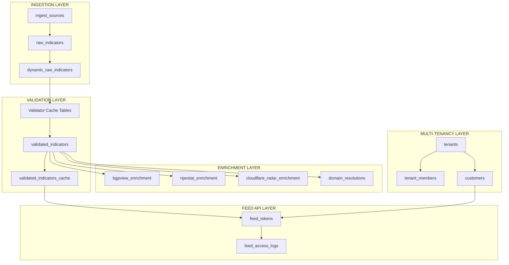
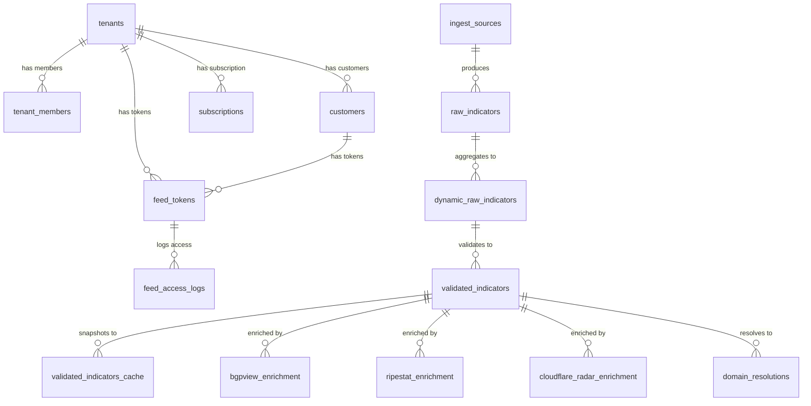
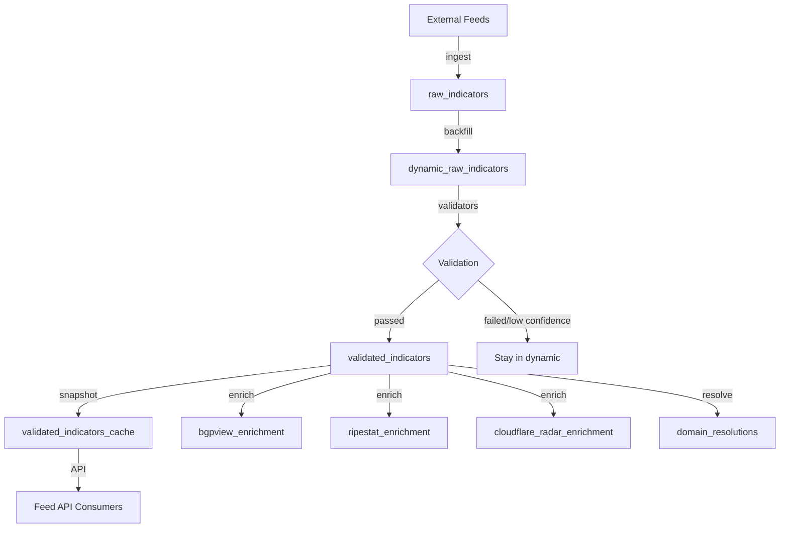
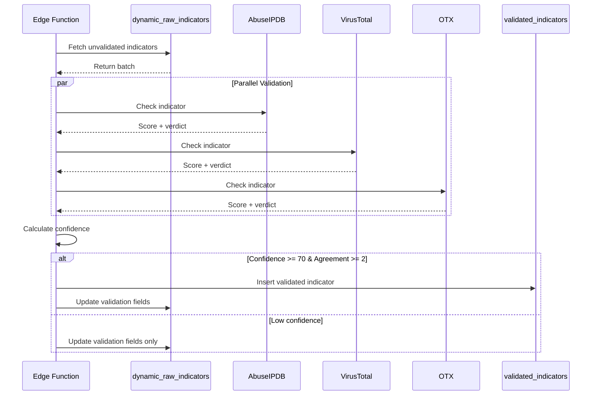

# IntelGuard Database Schema Documentation

**Project**: IntelGuard - Threat Intelligence Platform  
**Database**: PostgreSQL (Supabase/Lovable Cloud)  
**Version**: 1.0  
**Last Updated**: 2025-10-07  
**Super Admin UUID**: `6a251925-6da6-4e88-a4c2-a5624308fe8e`

---

## Table of Contents

1. [Architecture Overview](#architecture-overview)
2. [Core Tables](#core-tables)
3. [Validator Cache Tables](#validator-cache-tables)
4. [Enrichment Tables](#enrichment-tables)
5. [Multi-Tenancy Tables](#multi-tenancy-tables)
6. [System Tables](#system-tables)
7. [Views & Materialized Views](#views--materialized-views)
8. [Database Functions](#database-functions)
9. [RLS Policies Patterns](#rls-policies-patterns)
10. [Indexes & Performance](#indexes--performance)
11. [Foreign Keys & Relations](#foreign-keys--relations)
12. [Cron Jobs Schedule](#cron-jobs-schedule)
13. [Data Flow Diagrams](#data-flow-diagrams)
14. [Security Best Practices](#security-best-practices)

---

## Architecture Overview



---

## Core Tables

### `raw_indicators`

**Purpose**: Stores raw threat indicators from external sources before validation.

| Column | Type | Nullable | Default | Description |
|--------|------|----------|---------|-------------|
| id | bigint | No | nextval('raw_indicators_id_seq') | Primary key |
| indicator | text | No | - | IP address or domain |
| kind | text | No | - | Type: 'ipv4' or 'domain' |
| source | text | No | - | Origin feed name |
| first_seen | timestamptz | No | now() | First detection timestamp |
| last_seen | timestamptz | No | now() | Last detection timestamp |
| removed_at | timestamptz | Yes | NULL | Soft delete timestamp |

**Primary Key**: `id`

**Indexes**:
```sql
CREATE INDEX idx_raw_indicators_indicator ON raw_indicators(indicator);
CREATE INDEX idx_raw_indicators_kind ON raw_indicators(kind);
CREATE INDEX idx_raw_indicators_source ON raw_indicators(source);
CREATE INDEX idx_raw_indicators_removed_at ON raw_indicators(removed_at) WHERE removed_at IS NULL;
CREATE INDEX idx_raw_indicators_composite ON raw_indicators(indicator, kind, source) WHERE removed_at IS NULL;
```

**RLS Policies**:
- `super_admin_can_view_raw_indicators` (SELECT): `is_super_admin(auth.uid())`
- `super_admin_can_insert_raw_indicators` (INSERT): `is_super_admin(auth.uid())`
- `tenant_members_can_view_raw_indicators` (SELECT): `EXISTS (SELECT 1 FROM tenant_members WHERE user_id = auth.uid())`

---

### `dynamic_raw_indicators`

**Purpose**: Central validation table with aggregated sources and validator results.

| Column | Type | Nullable | Default | Description |
|--------|------|----------|---------|-------------|
| id | bigint | No | nextval('dynamic_raw_indicators_id_seq') | Primary key |
| indicator | text | No | - | IP address or domain |
| kind | text | No | - | Type: 'ipv4' or 'domain' |
| confidence | numeric | No | - | Confidence score (0-100) |
| sources | text[] | No | - | Array of feed sources |
| source_count | integer | No | 1 | Number of sources |
| first_validated | timestamptz | No | now() | First validation timestamp |
| last_validated | timestamptz | No | now() | Last validation timestamp |
| whitelisted | boolean | Yes | false | If in trusted whitelist |
| whitelist_source | text | Yes | NULL | Whitelist source name |
| **Abuse.ch Validator** |
| abuse_ch_checked | boolean | No | false | Checked by Abuse.ch |
| abuse_ch_is_fp | boolean | Yes | NULL | Is false positive |
| **AbuseIPDB Validator** |
| abuseipdb_checked | boolean | No | false | Checked by AbuseIPDB |
| abuseipdb_score | integer | Yes | NULL | AbuseIPDB confidence (0-100) |
| abuseipdb_in_blacklist | boolean | Yes | NULL | In AbuseIPDB blacklist |
| **Google Safe Browsing** |
| safebrowsing_checked | boolean | No | false | Checked by Safe Browsing |
| safebrowsing_score | integer | Yes | NULL | Safe Browsing score |
| safebrowsing_verdict | text | Yes | NULL | Verdict: 'MALWARE', 'SOCIAL_ENGINEERING', etc. |
| **HoneyDB Validator** |
| honeydb_checked | boolean | No | false | Checked by HoneyDB |
| honeydb_in_blacklist | boolean | Yes | NULL | In HoneyDB blacklist |
| honeydb_threat_score | integer | Yes | NULL | Threat score |
| **NeutrinoAPI Validator** |
| neutrinoapi_checked | boolean | No | false | Checked by NeutrinoAPI |
| neutrinoapi_in_blocklist | boolean | Yes | NULL | In NeutrinoAPI blocklist |
| neutrinoapi_host_reputation_score | integer | Yes | NULL | Host reputation (0-100) |
| neutrinoapi_is_proxy | boolean | Yes | NULL | Is proxy server |
| neutrinoapi_is_vpn | boolean | Yes | NULL | Is VPN server |
| neutrinoapi_is_hosting | boolean | Yes | NULL | Is hosting provider |
| neutrinoapi_metadata | jsonb | Yes | NULL | Additional metadata |
| **VirusTotal Validator** |
| virustotal_checked | boolean | No | false | Checked by VirusTotal |
| virustotal_score | integer | Yes | NULL | Malicious detections count |
| virustotal_malicious | boolean | Yes | NULL | Is malicious |
| **Censys Validator** |
| censys_checked | boolean | No | false | Checked by Censys |
| censys_score | integer | Yes | NULL | Censys score |
| censys_malicious | boolean | Yes | NULL | Is malicious |
| **OTX Validator** |
| otx_checked | boolean | No | false | Checked by AlienVault OTX |
| otx_score | integer | Yes | NULL | OTX score |
| otx_verdict | text | Yes | NULL | OTX verdict |
| **URLScan Validator** |
| urlscan_checked | boolean | No | false | Checked by URLScan.io |
| urlscan_score | integer | Yes | NULL | URLScan score |
| urlscan_malicious | boolean | Yes | NULL | Is malicious |
| **Cloudflare URLScan** |
| cloudflare_urlscan_checked | boolean | Yes | false | Checked by CF URLScan |
| cloudflare_urlscan_score | integer | Yes | NULL | CF URLScan score |
| cloudflare_urlscan_malicious | boolean | Yes | NULL | Is malicious |
| cloudflare_urlscan_categories | text[] | Yes | NULL | Categories array |
| cloudflare_urlscan_verdict | text | Yes | NULL | CF URLScan verdict |

**Primary Key**: `id`

**Unique Constraint**: `(indicator, kind)`

**Indexes**:
```sql
CREATE INDEX idx_dynamic_raw_indicators_indicator ON dynamic_raw_indicators(indicator);
CREATE INDEX idx_dynamic_raw_indicators_kind ON dynamic_raw_indicators(kind);
CREATE INDEX idx_dynamic_raw_indicators_confidence ON dynamic_raw_indicators(confidence DESC);
CREATE INDEX idx_dynamic_raw_indicators_sources_confidence ON dynamic_raw_indicators(source_count DESC, confidence DESC) WHERE whitelisted = false;
CREATE INDEX idx_dynamic_raw_indicators_validated ON dynamic_raw_indicators(last_validated DESC) WHERE confidence >= 50 AND whitelisted = false;
CREATE INDEX idx_dynamic_raw_indicators_whitelisted ON dynamic_raw_indicators(whitelisted, whitelist_source) WHERE whitelisted = true;
```

**RLS Policies**:
- `super_admin_full_access_dynamic_raw_indicators` (ALL): `is_super_admin(auth.uid())`
- `tenant_members_can_view_dynamic_raw_indicators` (SELECT): `EXISTS (SELECT 1 FROM tenant_members WHERE user_id = auth.uid())`

---

### `validated_indicators`

**Purpose**: Final validated threat indicators ready for feed distribution.

| Column | Type | Nullable | Default | Description |
|--------|------|----------|---------|-------------|
| id | uuid | No | gen_random_uuid() | Primary key |
| indicator | text | No | - | IP address or domain |
| kind | text | No | - | Type: 'ipv4' or 'domain' |
| confidence | numeric | No | - | Confidence score (0-100) |
| threat_type | text | Yes | NULL | Classified threat type |
| country | text | Yes | NULL | Geo location country code |
| asn | text | Yes | NULL | Autonomous System Number |
| last_validated | timestamptz | No | now() | Last validation timestamp |
| created_at | timestamptz | No | now() | Creation timestamp |

**Primary Key**: `id`

**Unique Constraint**: `(indicator, kind)`

**Indexes**:
```sql
CREATE INDEX idx_validated_indicators_indicator ON validated_indicators(indicator);
CREATE INDEX idx_validated_indicators_kind ON validated_indicators(kind);
CREATE INDEX idx_validated_indicators_confidence ON validated_indicators(confidence DESC);
CREATE INDEX idx_validated_indicators_threat_type ON validated_indicators(threat_type);
CREATE INDEX idx_validated_indicators_country ON validated_indicators(country);
CREATE INDEX idx_validated_indicators_last_validated ON validated_indicators(last_validated DESC);
```

**RLS Policies**:
- `super_admin_full_access_validated_indicators` (ALL): `is_super_admin(auth.uid())`
- `tenant_members_can_view_validated_indicators` (SELECT): `EXISTS (SELECT 1 FROM tenant_members WHERE user_id = auth.uid())`

**Threat Type Classification**:
- `phishing`: Social engineering attacks
- `malware`: Malware distribution
- `botnet`: Botnet/C2 infrastructure
- `proxy_abuse`: Proxy/VPN abuse
- `spam`: Spam source
- `suspicious`: Generic malicious activity
- `unknown`: Unknown threat type

---

### `validated_indicators_cache`

**Purpose**: Hourly snapshots for fast feed API responses.

| Column | Type | Nullable | Default | Description |
|--------|------|----------|---------|-------------|
| id | uuid | No | gen_random_uuid() | Primary key |
| indicator | text | No | - | IP address or domain |
| kind | text | No | - | Type: 'ipv4' or 'domain' |
| confidence | numeric | No | - | Confidence score |
| threat_type | text | Yes | NULL | Threat type |
| country | text | Yes | NULL | Country code |
| asn | text | Yes | NULL | ASN |
| last_validated | timestamptz | No | - | Last validation timestamp |
| snapshot_at | timestamptz | No | now() | Snapshot creation time |
| snapshot_hour | integer | No | EXTRACT(hour FROM now()) | Hour of snapshot (0-23) |
| created_at | timestamptz | No | now() | Record creation time |

**Primary Key**: `id`

**Indexes**:
```sql
CREATE INDEX idx_validated_indicators_cache_kind_hour ON validated_indicators_cache(kind, snapshot_hour);
CREATE INDEX idx_validated_indicators_cache_snapshot ON validated_indicators_cache(snapshot_hour, snapshot_at DESC);
CREATE INDEX idx_validated_indicators_cache_indicator ON validated_indicators_cache(indicator);
```

**RLS Policies**:
- `super_admin_full_access_validated_indicators_cache` (ALL): `is_super_admin(auth.uid())`
- `tenant_members_can_view_validated_indicators_cache` (SELECT): `EXISTS (SELECT 1 FROM tenant_members WHERE user_id = auth.uid())`

**Cache Strategy**: Snapshots created hourly, old snapshots from same hour deleted automatically.

---

## Validator Cache Tables

### `abuse_ch_fplist`

**Purpose**: Abuse.ch false positive list cache.

| Column | Type | Nullable | Default | Description |
|--------|------|----------|---------|-------------|
| indicator | text | No | - | IP or domain (PK) |
| kind | text | No | - | Type: 'ipv4' or 'domain' (PK) |
| added_at | timestamptz | No | now() | Addition timestamp |
| expires_at | timestamptz | No | now() + 7 days | Expiration timestamp |

**Primary Key**: `(indicator, kind)`

**TTL**: 7 days

**RLS Policies**:
- `super_admin_full_access_abuse_ch_fplist` (ALL): `is_super_admin(auth.uid())`
- `tenant_members_can_view_abuse_ch_fplist` (SELECT): `EXISTS (SELECT 1 FROM tenant_members WHERE user_id = auth.uid())`

---

### `abuseipdb_blacklist`

**Purpose**: AbuseIPDB blacklisted IPs cache.

| Column | Type | Nullable | Default | Description |
|--------|------|----------|---------|-------------|
| indicator | text | No | - | IP address (PK) |
| abuse_confidence_score | integer | No | - | Confidence score (0-100) |
| last_reported_at | timestamptz | No | - | Last report timestamp |
| added_at | timestamptz | No | now() | Cache addition time |
| expires_at | timestamptz | No | now() + 6 hours | Expiration timestamp |

**Primary Key**: `indicator`

**TTL**: 6 hours

**RLS Policies**:
- `super_admin_full_access_abuseipdb_blacklist` (ALL): `is_super_admin(auth.uid())`
- `tenant_members_can_view_abuseipdb_blacklist` (SELECT): `EXISTS (SELECT 1 FROM tenant_members WHERE user_id = auth.uid())`

---

### `google_safebrowsing_cache`

**Purpose**: Google Safe Browsing API results cache.

| Column | Type | Nullable | Default | Description |
|--------|------|----------|---------|-------------|
| indicator | text | No | - | URL/domain (PK) |
| kind | text | No | - | Type: 'domain' (PK) |
| is_threat | boolean | No | false | Is threat detected |
| score | integer | No | 0 | Threat score |
| verdict | text | No | 'clean' | Verdict string |
| threat_types | text[] | Yes | {} | Array of threat types |
| platform_types | text[] | Yes | {} | Platform types |
| threat_entry_types | text[] | Yes | {} | Entry types |
| raw_response | jsonb | Yes | NULL | Full API response |
| checked_at | timestamptz | No | now() | Check timestamp |
| expires_at | timestamptz | No | now() + 24 hours | Expiration timestamp |

**Primary Key**: `(indicator, kind)`

**TTL**: 24 hours

**Verdict Values**: 'clean', 'MALWARE', 'SOCIAL_ENGINEERING', 'UNWANTED_SOFTWARE', 'POTENTIALLY_HARMFUL_APPLICATION'

**RLS Policies**:
- `super_admin_full_access_safebrowsing_cache` (ALL): `is_super_admin(auth.uid())`
- `tenant_members_can_view_safebrowsing_cache` (SELECT): `EXISTS (SELECT 1 FROM tenant_members WHERE user_id = auth.uid())`

---

### `honeydb_blacklist`

**Purpose**: HoneyDB threat actor IPs cache.

| Column | Type | Nullable | Default | Description |
|--------|------|----------|---------|-------------|
| indicator | text | No | - | IP address (PK) |
| threat_score | integer | Yes | 0 | Threat score |
| last_seen | timestamptz | No | now() | Last seen timestamp |
| added_at | timestamptz | No | now() | Cache addition time |
| expires_at | timestamptz | No | now() + 24 hours | Expiration timestamp |

**Primary Key**: `indicator`

**TTL**: 24 hours

**RLS Policies**:
- `super_admin_full_access_honeydb_blacklist` (ALL): `is_super_admin(auth.uid())`
- `tenant_members_can_view_honeydb_blacklist` (SELECT): `EXISTS (SELECT 1 FROM tenant_members WHERE user_id = auth.uid())`

---

### `neutrinoapi_blocklist`

**Purpose**: NeutrinoAPI blocklist cache.

| Column | Type | Nullable | Default | Description |
|--------|------|----------|---------|-------------|
| indicator | text | No | - | IP address (PK) |
| kind | text | No | 'ipv4' | Type (PK) |
| category | text | Yes | NULL | Block category |
| added_at | timestamptz | No | now() | Cache addition time |
| expires_at | timestamptz | No | now() + 7 days | Expiration timestamp |

**Primary Key**: `(indicator, kind)`

**TTL**: 7 days

**RLS Policies**:
- `super_admin_full_access_neutrinoapi_blocklist` (ALL): `is_super_admin(auth.uid())`
- `tenant_members_can_view_neutrinoapi_blocklist` (SELECT): `EXISTS (SELECT 1 FROM tenant_members WHERE user_id = auth.uid())`

---

### `cloudflare_urlscan_cache`

**Purpose**: Cloudflare URL Scanner results cache.

| Column | Type | Nullable | Default | Description |
|--------|------|----------|---------|-------------|
| indicator | text | No | - | Domain/URL (PK) |
| kind | text | No | 'domain' | Type (PK) |
| scan_id | uuid | Yes | NULL | Scan UUID |
| malicious | boolean | Yes | false | Is malicious |
| score | integer | Yes | NULL | Malicious score |
| verdict | text | Yes | NULL | Verdict string |
| categories | text[] | Yes | NULL | Categories array |
| technologies | jsonb | Yes | NULL | Detected technologies |
| certificates | jsonb | Yes | NULL | SSL certificates |
| raw_response | jsonb | Yes | NULL | Full API response |
| checked_at | timestamptz | No | now() | Check timestamp |
| expires_at | timestamptz | No | now() + 7 days | Expiration timestamp |

**Primary Key**: `(indicator, kind)`

**TTL**: 7 days

**RLS Policies**:
- `super_admin_full_access_cloudflare_urlscan_cache` (ALL): `is_super_admin(auth.uid())`
- `tenant_members_can_view_cloudflare_urlscan_cache` (SELECT): `EXISTS (SELECT 1 FROM tenant_members WHERE user_id = auth.uid())`

---

### `otx_enrichment`

**Purpose**: AlienVault OTX threat intelligence cache.

| Column | Type | Nullable | Default | Description |
|--------|------|----------|---------|-------------|
| indicator | text | No | - | IP/domain (PK) |
| kind | text | No | - | Type (PK) |
| score | integer | Yes | NULL | OTX score |
| verdict | text | Yes | NULL | Verdict string |
| pulses_count | integer | Yes | 0 | Number of pulses |
| authors_count | integer | Yes | 0 | Number of authors |
| latest_pulse | timestamptz | Yes | NULL | Latest pulse timestamp |
| tags | text[] | Yes | NULL | Tags array |
| reasons | text[] | Yes | NULL | Reasons array |
| country | text | Yes | NULL | Country code |
| asn | text | Yes | NULL | ASN |
| pulse_info | jsonb | Yes | NULL | Pulse details |
| passive_dns | jsonb | Yes | NULL | Passive DNS data |
| url_list | jsonb | Yes | NULL | Associated URLs |
| malware_samples | jsonb | Yes | NULL | Malware samples |
| raw_otx | jsonb | Yes | NULL | Full API response |
| refreshed_at | timestamptz | No | now() | Last refresh |
| ttl_seconds | integer | Yes | 86400 | TTL in seconds |

**Primary Key**: `(indicator, kind)`

**TTL**: Dynamic (default 86400 seconds = 24 hours)

**RLS Policies**:
- `super_admin_full_access_otx_enrichment` (ALL): `is_super_admin(auth.uid())`
- `tenant_members_can_view_otx_enrichment` (SELECT): `EXISTS (SELECT 1 FROM tenant_members WHERE user_id = auth.uid())`

---

## Enrichment Tables

### `bgpview_enrichment`

**Purpose**: BGPView IP/ASN enrichment data.

| Column | Type | Nullable | Default | Description |
|--------|------|----------|---------|-------------|
| id | uuid | No | gen_random_uuid() | Primary key |
| indicator | text | No | - | IP address (Unique) |
| kind | text | No | 'ipv4' | Type |
| asn | bigint | Yes | NULL | ASN number |
| asn_name | text | Yes | NULL | ASN name |
| asn_description | text | Yes | NULL | ASN description |
| prefix | text | Yes | NULL | IP prefix (CIDR) |
| cidr | integer | Yes | NULL | CIDR notation |
| country_code | text | Yes | NULL | Country code |
| ptr_record | text | Yes | NULL | PTR record |
| raw_response | jsonb | Yes | NULL | Full API response |
| checked_at | timestamptz | No | now() | Check timestamp |
| expires_at | timestamptz | No | now() + 24 hours | Expiration timestamp |

**Primary Key**: `id`

**Unique Constraint**: `indicator`

**TTL**: 24 hours

**RLS Policies**:
- `super_admin_full_access_bgpview` (ALL): `is_super_admin(auth.uid())`
- `tenant_members_can_view_bgpview` (SELECT): `EXISTS (SELECT 1 FROM tenant_members WHERE user_id = auth.uid())`

---

### `ripestat_enrichment`

**Purpose**: RIPE Stat API enrichment data.

| Column | Type | Nullable | Default | Description |
|--------|------|----------|---------|-------------|
| id | uuid | No | gen_random_uuid() | Primary key |
| indicator | text | No | - | IP address (Unique) |
| kind | text | No | - | Type |
| asn | bigint | Yes | NULL | ASN number |
| asn_holder | text | Yes | NULL | ASN holder name |
| prefix | text | Yes | NULL | IP prefix |
| country_code | text | Yes | NULL | Country code |
| country_name | text | Yes | NULL | Country name |
| city | text | Yes | NULL | City name |
| latitude | numeric | Yes | NULL | Latitude |
| longitude | numeric | Yes | NULL | Longitude |
| ptr_record | text | Yes | NULL | PTR record |
| abuse_email | text | Yes | NULL | Abuse contact email |
| whois_data | jsonb | Yes | NULL | WHOIS data |
| geolocation_data | jsonb | Yes | NULL | Geolocation data |
| network_info | jsonb | Yes | NULL | Network info |
| routing_status | jsonb | Yes | NULL | Routing status |
| checked_at | timestamptz | No | now() | Check timestamp |
| expires_at | timestamptz | No | now() + 30 days | Expiration timestamp |

**Primary Key**: `id`

**Unique Constraint**: `(indicator, kind)`

**TTL**: 30 days

**RLS Policies**:
- `super_admin_full_access_ripestat_enrichment` (ALL): `is_super_admin(auth.uid())`
- `tenant_members_can_view_ripestat_enrichment` (SELECT): `EXISTS (SELECT 1 FROM tenant_members WHERE user_id = auth.uid())`

---

### `cloudflare_radar_enrichment`

**Purpose**: Cloudflare Radar API enrichment data.

| Column | Type | Nullable | Default | Description |
|--------|------|----------|---------|-------------|
| id | uuid | No | gen_random_uuid() | Primary key |
| indicator | text | No | - | IP address (Unique) |
| kind | text | No | 'ipv4' | Type |
| asn | bigint | Yes | NULL | ASN number |
| asn_name | text | Yes | NULL | ASN name |
| prefix | text | Yes | NULL | IP prefix |
| country_code | text | Yes | NULL | Country code |
| raw_response | jsonb | Yes | NULL | Full API response |
| checked_at | timestamptz | No | now() | Check timestamp |
| expires_at | timestamptz | No | now() + 12 hours | Expiration timestamp |

**Primary Key**: `id`

**Unique Constraint**: `(indicator, kind)`

**TTL**: 12 hours

**RLS Policies**:
- `super_admin_full_access_cf_radar` (ALL): `is_super_admin(auth.uid())`
- `tenant_members_can_view_cf_radar` (SELECT): `EXISTS (SELECT 1 FROM tenant_members WHERE user_id = auth.uid())`

---

### `domain_resolutions`

**Purpose**: DNS resolution results for domains.

| Column | Type | Nullable | Default | Description |
|--------|------|----------|---------|-------------|
| domain | text | No | - | Domain name (PK) |
| resolved_ip | text | No | - | Resolved IP (PK) |
| resolver_source | text | No | 'cloudflare-doh' | DNS resolver used |
| country | text | Yes | NULL | IP country code |
| asn | text | Yes | NULL | IP ASN |
| ttl | integer | No | 3600 | DNS TTL in seconds |
| resolved_at | timestamptz | No | now() | Resolution timestamp |
| expires_at | timestamptz | No | - | Expiration timestamp |

**Primary Key**: `(domain, resolved_ip)`

**TTL**: Dynamic based on DNS TTL

**RLS Policies**:
- `super_admin_full_access_domain_resolutions` (ALL): `is_super_admin(auth.uid())`
- `tenant_members_can_view_domain_resolutions` (SELECT): `EXISTS (SELECT 1 FROM tenant_members WHERE user_id = auth.uid())`

---

## Multi-Tenancy Tables

### `tenants`

**Purpose**: Top-level tenant organizations.

| Column | Type | Nullable | Default | Description |
|--------|------|----------|---------|-------------|
| id | uuid | No | gen_random_uuid() | Primary key |
| name | text | No | - | Tenant name |
| type | text | No | - | Tenant type |
| owner_user_id | uuid | No | - | Owner user ID |
| created_at | timestamptz | No | now() | Creation timestamp |

**Primary Key**: `id`

**RLS Policies**:
- `tenants_insert` (INSERT): `true` (anyone can create tenant)
- `tenants_select` (SELECT): `EXISTS (SELECT 1 FROM tenant_members WHERE tenant_id = tenants.id AND user_id = auth.uid())`
- `tenants_update` (UPDATE): `auth.uid() = owner_user_id`

**Security Note**: No DELETE policy - tenants cannot be deleted via RLS.

---

### `tenant_members`

**Purpose**: User membership in tenants.

| Column | Type | Nullable | Default | Description |
|--------|------|----------|---------|-------------|
| tenant_id | uuid | No | - | Tenant ID (PK) |
| user_id | uuid | No | - | User ID (PK) |
| role | text | No | - | Member role |
| created_at | timestamptz | No | now() | Membership creation time |

**Primary Key**: `(tenant_id, user_id)`

**RLS Policies**:
- `tenant_members_select` (SELECT): `is_tenant_member(auth.uid(), tenant_id)`
- `tenant_members_insert` (INSERT): `is_tenant_member(auth.uid(), tenant_id) OR NOT EXISTS (SELECT 1 FROM tenant_members WHERE tenant_id = tenant_id)`
- `tenant_members_update` (UPDATE): `is_tenant_member(auth.uid(), tenant_id)`

**Security Note**: No DELETE policy - members cannot be deleted via RLS.

---

### `customers`

**Purpose**: Sub-organizations within tenants.

| Column | Type | Nullable | Default | Description |
|--------|------|----------|---------|-------------|
| id | uuid | No | gen_random_uuid() | Primary key |
| tenant_id | uuid | No | - | Parent tenant ID |
| name | text | No | - | Customer name |
| created_at | timestamptz | No | now() | Creation timestamp |

**Primary Key**: `id`

**RLS Policies**:
- `customers_rw` (ALL): `EXISTS (SELECT 1 FROM tenant_members WHERE tenant_id = customers.tenant_id AND user_id = auth.uid())`

---

### `feed_tokens`

**Purpose**: API tokens for feed access.

| Column | Type | Nullable | Default | Description |
|--------|------|----------|---------|-------------|
| id | uuid | No | gen_random_uuid() | Primary key |
| token | text | No | - | API token (Unique) |
| type | text | No | - | Token type ('ipv4' or 'domain') |
| tenant_id | uuid | Yes | NULL | Tenant ID (for tenant-level tokens) |
| customer_id | uuid | Yes | NULL | Customer ID (for customer-level tokens) |
| enabled | boolean | No | true | Token active status |
| created_at | timestamptz | No | now() | Creation timestamp |

**Primary Key**: `id`

**Unique Constraint**: `token`

**RLS Policies**:
```sql
-- Complex policy: different logic for tenant vs customer tokens
CASE 
  WHEN customer_id IS NULL THEN 
    EXISTS (SELECT 1 FROM tenant_members WHERE tenant_id = feed_tokens.tenant_id AND user_id = auth.uid())
  ELSE 
    EXISTS (SELECT 1 FROM customers c JOIN tenant_members tm ON tm.tenant_id = c.tenant_id 
            WHERE c.id = feed_tokens.customer_id AND tm.user_id = auth.uid())
END
```

---

### `feed_access_logs`

**Purpose**: Audit logs for feed API access.

| Column | Type | Nullable | Default | Description |
|--------|------|----------|---------|-------------|
| id | bigint | No | nextval('feed_access_logs_id_seq') | Primary key |
| token | text | No | - | API token used |
| kind | text | No | - | Feed type accessed |
| ip | text | Yes | NULL | Client IP address |
| ua | text | Yes | NULL | User agent |
| created_at | timestamptz | No | now() | Access timestamp |

**Primary Key**: `id`

**Indexes**:
```sql
CREATE INDEX idx_feed_access_logs_token ON feed_access_logs(token);
CREATE INDEX idx_feed_access_logs_created_at ON feed_access_logs(created_at DESC);
```

**RLS Policies**:
- `feed_access_logs_select` (SELECT): `EXISTS (SELECT 1 FROM feed_tokens ft JOIN tenant_members tm ON tm.tenant_id = ft.tenant_id WHERE ft.token = feed_access_logs.token AND tm.user_id = auth.uid())`

**Security Note**: No INSERT/UPDATE/DELETE policies - logs are append-only via edge functions.

---

## System Tables

### `ingest_sources`

**Purpose**: Configuration for external threat feed sources.

| Column | Type | Nullable | Default | Description |
|--------|------|----------|---------|-------------|
| id | uuid | No | gen_random_uuid() | Primary key |
| name | text | No | - | Source name |
| url | text | No | - | Feed URL |
| kind | text | No | - | Type: 'ipv4' or 'domain' |
| description | text | Yes | NULL | Source description |
| enabled | boolean | No | true | Source active status |
| priority | integer | Yes | 50 | Priority (0-100) |
| indicators_count | integer | Yes | 0 | Total indicators fetched |
| last_run | timestamptz | Yes | NULL | Last ingestion time |
| last_attempt | timestamptz | Yes | NULL | Last attempt time |
| last_success | timestamptz | Yes | NULL | Last success time |
| last_error | text | Yes | NULL | Last error message |
| created_at | timestamptz | No | now() | Creation timestamp |
| updated_at | timestamptz | No | now() | Update timestamp |

**Primary Key**: `id`

**RLS Policies**:
- `super_admin_can_manage_ingest_sources` (ALL): `is_super_admin(auth.uid())`
- `tenant_members_can_view_ingest_sources` (SELECT): `EXISTS (SELECT 1 FROM tenant_members WHERE user_id = auth.uid())`

---

### `ingest_logs`

**Purpose**: Audit logs for ingestion operations.

| Column | Type | Nullable | Default | Description |
|--------|------|----------|---------|-------------|
| id | bigint | No | - | Primary key |
| source_id | uuid | No | - | Ingest source ID |
| source_name | text | No | - | Source name |
| status | text | No | - | Status: 'running', 'success', 'error' |
| indicators_fetched | integer | Yes | 0 | Indicators fetched count |
| error_message | text | Yes | NULL | Error message if failed |
| started_at | timestamptz | No | now() | Start timestamp |
| completed_at | timestamptz | Yes | NULL | Completion timestamp |
| duration_ms | integer | Yes | NULL | Duration in milliseconds |

**Primary Key**: `id`

**RLS Policies**:
- `super_admin_full_access_ingest_logs` (ALL): `is_super_admin(auth.uid())`
- `tenant_members_can_view_ingest_logs` (SELECT): `EXISTS (SELECT 1 FROM tenant_members WHERE user_id = auth.uid())`

---

### `validator_status`

**Purpose**: Status tracking for external validators.

| Column | Type | Nullable | Default | Description |
|--------|------|----------|---------|-------------|
| validator_name | text | No | - | Validator name (PK) |
| status | text | No | 'active' | Status: 'active', 'degraded', 'down' |
| last_error | text | Yes | NULL | Last error message |
| quota_reset_at | timestamptz | Yes | NULL | Quota reset timestamp |
| updated_at | timestamptz | No | now() | Last update timestamp |

**Primary Key**: `validator_name`

**RLS Policies**:
- `super_admin_full_access_validator_status` (ALL): `is_super_admin(auth.uid())`
- `tenant_members_can_view_validator_status` (SELECT): `EXISTS (SELECT 1 FROM tenant_members WHERE user_id = auth.uid())`

---

### `abuseipdb_quota`

**Purpose**: Daily quota tracking for AbuseIPDB API.

| Column | Type | Nullable | Default | Description |
|--------|------|----------|---------|-------------|
| id | uuid | No | gen_random_uuid() | Primary key |
| date | date | No | CURRENT_DATE | Quota date (Unique) |
| daily_limit | integer | No | 1000 | Daily API limit |
| used_count | integer | No | 0 | Used API calls |
| remaining_count | integer | Yes | NULL | Remaining calls (computed) |
| last_reset_at | timestamptz | No | now() | Last reset timestamp |
| created_at | timestamptz | No | now() | Creation timestamp |
| updated_at | timestamptz | No | now() | Update timestamp |

**Primary Key**: `id`

**Unique Constraint**: `date`

**RLS Policies**:
- `super_admin_full_access_abuseipdb_quota` (ALL): `is_super_admin(auth.uid())`
- `tenant_members_can_view_abuseipdb_quota` (SELECT): `EXISTS (SELECT 1 FROM tenant_members WHERE user_id = auth.uid())`

---

### `censys_monthly_usage`

**Purpose**: Monthly quota tracking for Censys API.

| Column | Type | Nullable | Default | Description |
|--------|------|----------|---------|-------------|
| id | uuid | No | gen_random_uuid() | Primary key |
| month | date | No | - | Month (first day, Unique) |
| api_calls_count | integer | No | 0 | API calls used |
| created_at | timestamptz | No | now() | Creation timestamp |
| updated_at | timestamptz | No | now() | Update timestamp |

**Primary Key**: `id`

**Unique Constraint**: `month`

**Monthly Limit**: 100 API calls

**RLS Policies**:
- `super_admin_full_access_censys_monthly_usage` (ALL): `is_super_admin(auth.uid())`
- `tenant_members_can_view_censys_monthly_usage` (SELECT): `EXISTS (SELECT 1 FROM tenant_members WHERE user_id = auth.uid())`

---

### `network_activity_log`

**Purpose**: Network activity audit log for edge functions.

| Column | Type | Nullable | Default | Description |
|--------|------|----------|---------|-------------|
| id | uuid | No | gen_random_uuid() | Primary key |
| edge_function_name | text | Yes | NULL | Edge function name |
| call_type | text | No | - | Call type |
| target_name | text | No | - | Target name |
| target_url | text | No | - | Target URL |
| method | text | No | 'GET' | HTTP method |
| status | text | No | 'active' | Status |
| status_code | integer | Yes | NULL | HTTP status code |
| response_time_ms | integer | Yes | NULL | Response time |
| bytes_transferred | bigint | Yes | NULL | Bytes transferred |
| items_total | integer | Yes | NULL | Total items |
| items_processed | integer | Yes | 0 | Processed items |
| request_headers | jsonb | Yes | NULL | Request headers |
| error_message | text | Yes | NULL | Error message |
| metadata | jsonb | Yes | NULL | Additional metadata |
| user_id | uuid | Yes | NULL | User ID |
| started_at | timestamptz | No | now() | Start timestamp |
| completed_at | timestamptz | Yes | NULL | Completion timestamp |

**Primary Key**: `id`

**RLS Policies**:
- `super_admin_full_access_network_activity_log` (ALL): `is_super_admin(auth.uid())`

---

### `system_audit_logs`

**Purpose**: System-wide audit logs.

| Column | Type | Nullable | Default | Description |
|--------|------|----------|---------|-------------|
| id | uuid | No | gen_random_uuid() | Primary key |
| user_id | uuid | Yes | NULL | User ID |
| operation_type | text | No | - | Operation type |
| operation_name | text | No | - | Operation name |
| description | text | Yes | NULL | Description |
| status | text | No | 'started' | Status |
| execution_time_ms | integer | Yes | NULL | Execution time |
| metadata | jsonb | Yes | {} | Metadata |
| created_at | timestamptz | No | now() | Creation timestamp |

**Primary Key**: `id`

**RLS Policies**:
- `super_admin_full_access_system_audit_logs` (ALL): `is_super_admin(auth.uid())`
- `users_can_view_own_logs` (SELECT): `auth.uid() = user_id`
- `users_can_insert_own_logs` (INSERT): `auth.uid() = user_id`
- `users_can_update_own_logs` (UPDATE): `auth.uid() = user_id`

---

### `cron_watchdog_logs`

**Purpose**: Cron job monitoring and recovery logs.

| Column | Type | Nullable | Default | Description |
|--------|------|----------|---------|-------------|
| id | uuid | No | gen_random_uuid() | Primary key |
| jobid | bigint | No | - | Cron job ID |
| jobname | text | No | - | Job name |
| action | text | No | - | Action: 'detected_stuck', 'unscheduled', 'rescheduled', 'error' |
| runtime_minutes | integer | Yes | NULL | Runtime in minutes |
| details | text | Yes | NULL | Details |
| created_at | timestamptz | No | now() | Creation timestamp |

**Primary Key**: `id`

**RLS Policies**:
- `super_admin_full_access_cron_watchdog_logs` (ALL): `is_super_admin(auth.uid())`
- `tenant_members_can_view_cron_watchdog_logs` (SELECT): `EXISTS (SELECT 1 FROM tenant_members WHERE user_id = auth.uid())`

---

### `validation_jobs`

**Purpose**: Validation job queue (legacy, not actively used).

| Column | Type | Nullable | Default | Description |
|--------|------|----------|---------|-------------|
| id | bigint | No | nextval('validation_jobs_id_seq') | Primary key |
| indicator | text | No | - | Indicator to validate |
| kind | text | No | - | Type |
| status | text | No | 'PENDING' | Status |
| attempts | integer | No | 0 | Attempt count |
| scheduled_at | timestamptz | No | now() | Schedule time |
| updated_at | timestamptz | No | now() | Update time |

**Primary Key**: `id`

**RLS Policies**:
- `super_admin_full_access_validation_jobs` (ALL): `is_super_admin(auth.uid())`
- `tenant_members_can_view_validation_jobs` (SELECT): `EXISTS (SELECT 1 FROM tenant_members WHERE user_id = auth.uid())`

---

### `daily_deltas`

**Purpose**: Daily change tracking for indicators.

| Column | Type | Nullable | Default | Description |
|--------|------|----------|---------|-------------|
| id | bigint | No | nextval('daily_deltas_id_seq') | Primary key |
| run_date | date | No | - | Date (PK) |
| kind | text | No | - | Type (PK) |
| added | integer | No | - | Added indicators |
| removed | integer | No | - | Removed indicators |

**Primary Key**: `id`

**Unique Constraint**: `(run_date, kind)`

**RLS Policies**:
- `super_admin_full_access_daily_deltas` (ALL): `is_super_admin(auth.uid())`
- `tenant_members_can_view_daily_deltas` (SELECT): `EXISTS (SELECT 1 FROM tenant_members WHERE user_id = auth.uid())`

---

### `indicator_snapshots`

**Purpose**: Historical snapshots of indicators by source.

| Column | Type | Nullable | Default | Description |
|--------|------|----------|---------|-------------|
| id | bigint | No | nextval('indicator_snapshots_id_seq') | Primary key |
| indicator | text | No | - | Indicator value |
| kind | text | No | - | Type |
| source | text | No | - | Source name |
| snapshot_date | date | No | - | Snapshot date |
| created_at | timestamptz | No | now() | Creation timestamp |

**Primary Key**: `id`

**RLS Policies**:
- `super_admin_full_access_indicator_snapshots` (ALL): `is_super_admin(auth.uid())`
- `indicator_snapshots_select` (SELECT): `EXISTS (SELECT 1 FROM tenant_members WHERE user_id = auth.uid())`

---

### `trusted_domains`

**Purpose**: Manually curated trusted/whitelisted domains.

| Column | Type | Nullable | Default | Description |
|--------|------|----------|---------|-------------|
| domain | text | No | - | Domain name (PK) |
| source | text | No | - | Source (PK) |
| rank | integer | Yes | NULL | Ranking |
| notes | text | Yes | NULL | Notes |
| added_at | timestamptz | No | now() | Addition timestamp |
| verified_at | timestamptz | Yes | NULL | Verification timestamp |

**Primary Key**: `(domain, source)`

**RLS Policies**:
- `super_admin_full_access_trusted_domains` (ALL): `is_super_admin(auth.uid())`
- `tenant_members_can_view_trusted_domains` (SELECT): `EXISTS (SELECT 1 FROM tenant_members WHERE user_id = auth.uid())`

---

### `email_preferences`

**Purpose**: User email notification preferences.

| Column | Type | Nullable | Default | Description |
|--------|------|----------|---------|-------------|
| user_id | uuid | No | - | User ID (PK) |
| type | text | No | 'ipv4' | Feed type (PK) |
| freq | text | No | 'monthly' | Frequency |
| updated_at | timestamptz | No | now() | Update timestamp |

**Primary Key**: `(user_id, type)`

**RLS Policies**:
- `Users can view their own email preferences` (SELECT): `auth.uid() = user_id`
- `Users can insert their own email preferences` (INSERT): `auth.uid() = user_id`
- `Users can update their own email preferences` (UPDATE): `auth.uid() = user_id`

---

### `subscriptions`

**Purpose**: Tenant subscription management (Stripe integration).

| Column | Type | Nullable | Default | Description |
|--------|------|----------|---------|-------------|
| id | uuid | No | gen_random_uuid() | Primary key |
| tenant_id | uuid | No | - | Tenant ID |
| plan | text | No | - | Plan name |
| status | text | No | - | Status |
| stripe_customer_id | text | No | - | Stripe customer ID |
| stripe_subscription_id | text | No | - | Stripe subscription ID |
| current_period_end | timestamptz | Yes | NULL | Current period end |
| created_at | timestamptz | No | now() | Creation timestamp |

**Primary Key**: `id`

**RLS Policies**:
- `subscriptions_rw` (ALL): `EXISTS (SELECT 1 FROM tenant_members WHERE tenant_id = subscriptions.tenant_id AND user_id = auth.uid())`

---

### `support_tickets`

**Purpose**: Support ticket management.

| Column | Type | Nullable | Default | Description |
|--------|------|----------|---------|-------------|
| id | uuid | No | gen_random_uuid() | Primary key |
| user_id | uuid | Yes | NULL | User ID |
| tenant_id | uuid | Yes | NULL | Tenant ID |
| subject | text | Yes | NULL | Ticket subject |
| message | text | Yes | NULL | Ticket message |
| created_at | timestamptz | No | now() | Creation timestamp |

**Primary Key**: `id`

**RLS Policies**:
```sql
-- User can access own tickets or tenant tickets
(user_id = auth.uid()) OR 
EXISTS (SELECT 1 FROM tenant_members WHERE tenant_id = support_tickets.tenant_id AND user_id = auth.uid())
```

---

## Views & Materialized Views

### `cron_job_status` (View)

**Purpose**: Real-time cron job status from pg_cron extension.

| Column | Type | Description |
|--------|------|-------------|
| jobid | bigint | Job ID |
| jobname | text | Job name |
| schedule | text | Cron schedule |
| database | text | Target database |
| active | boolean | Is active |
| last_run_start | timestamptz | Last run start |
| last_run_end | timestamptz | Last run end |
| last_status | text | Last status |
| last_error | text | Last error |
| last_duration_seconds | integer | Duration |
| next_run_estimated | timestamptz | Next estimated run |

**Source**: Joins `cron.job` and `cron.job_run_details` tables.

---

### `validator_coverage` (View)

**Purpose**: Validator coverage statistics by indicator kind.

| Column | Type | Description |
|--------|------|-------------|
| kind | text | Indicator type |
| total_indicators | bigint | Total indicators |
| safebrowsing_checked | bigint | Safe Browsing checked count |
| safebrowsing_pct | numeric | Safe Browsing coverage % |
| abuseipdb_checked | bigint | AbuseIPDB checked count |
| abuseipdb_pct | numeric | AbuseIPDB coverage % |
| virustotal_checked | bigint | VirusTotal checked count |
| virustotal_pct | numeric | VirusTotal coverage % |
| otx_checked | bigint | OTX checked count |
| otx_pct | numeric | OTX coverage % |
| urlscan_checked | bigint | URLScan checked count |
| urlscan_pct | numeric | URLScan coverage % |

**Source**: Aggregates from `dynamic_raw_indicators`.

---

### `validator_stats_mv` (Materialized View)

**Purpose**: Cached validator statistics (refreshed periodically).

**Refresh Function**: `refresh_validator_stats_mv()`

---

### `dashboard_stats_mv` (Materialized View)

**Purpose**: Dashboard statistics cache.

| Column | Type | Description |
|--------|------|-------------|
| kind | text | Indicator type |
| validated_count | bigint | Validated count |
| countries_count | bigint | Unique countries |
| asn_count | bigint | Unique ASNs |

**Accessed via**: `get_dashboard_stats()` function

---

### `raw_indicator_stats_mv` (Materialized View)

**Purpose**: Raw indicator statistics cache.

**Accessed via**: `get_raw_indicator_stats()` function

---

## Database Functions

### Security Functions

#### `is_super_admin(_user_id uuid) RETURNS boolean`

**Purpose**: Check if user is super admin.

**Logic**: Returns true if `_user_id = '6a251925-6da6-4e88-a4c2-a5624308fe8e'`

**Security**: `SECURITY DEFINER`, `STABLE`

**Usage**:
```sql
SELECT is_super_admin(auth.uid());
```

---

#### `is_tenant_member(_user_id uuid, _tenant_id uuid) RETURNS boolean`

**Purpose**: Check if user is member of tenant.

**Logic**: 
```sql
SELECT EXISTS (
  SELECT 1 FROM public.tenant_members
  WHERE user_id = _user_id AND tenant_id = _tenant_id
)
```

**Security**: `SECURITY DEFINER`, `STABLE`

**Usage**:
```sql
SELECT is_tenant_member(auth.uid(), 'tenant-uuid-here');
```

---

### Validation Functions

#### `merge_validator_result(...) RETURNS void`

**Purpose**: Merge validator results into `dynamic_raw_indicators`.

**Parameters**:
- `p_indicator` (text): Indicator value
- `p_kind` (text): Type
- `p_new_source` (text): Source name
- `p_confidence` (numeric): Confidence score
- `p_validator_fields` (jsonb): Validator-specific fields

**Logic**:
1. Fetches existing sources array
2. Merges new source if not present
3. Upserts record with all validator fields
4. Uses COALESCE to preserve existing validator data

**Security**: `SECURITY DEFINER`

**Example**:
```sql
SELECT merge_validator_result(
  '8.8.8.8',
  'ipv4',
  'abuse-ch',
  75.0,
  '{"abuseipdb_checked": true, "abuseipdb_score": 80}'::jsonb
);
```

---

#### `classify_threat_type(indicator_row dynamic_raw_indicators) RETURNS text`

**Purpose**: Classify threat type based on validator results.

**Classification Logic**:
1. **Phishing**: safebrowsing = 'SOCIAL_ENGINEERING' OR cloudflare categories contain 'phishing'
2. **Malware**: urlscan/cloudflare malicious OR safebrowsing = 'MALWARE'/'UNWANTED_SOFTWARE'
3. **Botnet**: honeydb blacklist OR abuse_ch checked OR virustotal malicious (score > 5)
4. **Proxy Abuse**: neutrinoapi is_proxy OR is_vpn
5. **Spam**: abuseipdb blacklist AND score > 50
6. **Suspicious**: confidence >= 50 AND (virustotal OR censys malicious)
7. **Unknown**: Default

**Security**: `SECURITY DEFINER`, `STABLE`

**Returns**: text (threat_type)

---

### Cache Management Functions

#### `clean_expired_*_cache() RETURNS void`

**Purpose**: Clean expired cache entries.

**Functions**:
- `clean_expired_abuse_ch_fplist()`
- `clean_expired_abuseipdb_blacklist()`
- `clean_expired_honeydb_blacklist()`
- `clean_expired_neutrinoapi_blocklist()`
- `clean_expired_virustotal_cache()`
- `clean_expired_safebrowsing_cache()`
- `clean_expired_cloudflare_urlscan_cache()`
- `clean_expired_otx_cache()`
- `clean_expired_bgpview_cache()`
- `clean_expired_ripestat_cache()`
- `clean_expired_cf_radar_cache()`
- `clean_expired_domain_resolutions()`

**Logic**: `DELETE FROM table WHERE expires_at < NOW()`

**Security**: `SECURITY DEFINER`

**Scheduled**: Daily via cron

---

### Quota Management Functions

#### `increment_abuseipdb_usage(calls_count integer DEFAULT 1) RETURNS void`

**Purpose**: Increment AbuseIPDB daily quota usage.

**Logic**:
```sql
INSERT INTO abuseipdb_quota (date, used_count, last_reset_at)
VALUES (CURRENT_DATE, calls_count, NOW())
ON CONFLICT (date)
DO UPDATE SET 
  used_count = abuseipdb_quota.used_count + calls_count,
  updated_at = NOW();
```

**Security**: `SECURITY DEFINER`

---

#### `get_current_day_abuseipdb_quota() RETURNS TABLE(...)`

**Purpose**: Get current day AbuseIPDB quota status.

**Returns**:
- id, date, daily_limit, used_count, remaining_count, last_reset_at

**Logic**: Auto-creates record if doesn't exist for current date.

**Security**: `SECURITY DEFINER`

---

#### `increment_censys_usage(calls_count integer DEFAULT 1) RETURNS void`

**Purpose**: Increment Censys monthly quota usage.

**Logic**: Similar to AbuseIPDB but monthly-based.

**Security**: `SECURITY DEFINER`

---

#### `get_current_month_censys_usage() RETURNS TABLE(...)`

**Purpose**: Get current month Censys quota status.

**Returns**:
- id, month, api_calls_count, remaining_calls

**Logic**: Auto-creates record if doesn't exist for current month.

**Security**: `SECURITY DEFINER`

---

### Backfill Functions

#### `backfill_dynamic_raw_indicators(batch_size integer DEFAULT 5000) RETURNS TABLE(...)`

**Purpose**: Backfill dynamic_raw_indicators from raw_indicators.

**Parameters**:
- `batch_size`: Batch size (default 5000)

**Returns**:
- `processed_count`: Processed indicators
- `total_batches`: Batch count
- `execution_time_ms`: Execution time

**Logic**:
1. Aggregates raw_indicators by (indicator, kind)
2. Computes sources array and source_count
3. Inserts into dynamic_raw_indicators in batches
4. Creates indexes if not exist

**Security**: `SECURITY DEFINER`

---

#### `safe_backfill_batch(batch_size integer DEFAULT 500) RETURNS TABLE(...)`

**Purpose**: Safe backfill with timeout protection.

**Parameters**:
- `batch_size`: Batch size (default 500)

**Returns**:
- `processed`: Processed count
- `success`: Success flag
- `error_msg`: Error message

**Timeout**: 10 seconds per batch

**Security**: `SECURITY DEFINER`

---

#### `priority_backfill_domains(batch_size integer DEFAULT 5000) RETURNS TABLE(...)`

**Purpose**: Prioritize domain backfilling.

**Parameters**:
- `batch_size`: Batch size (default 5000)

**Returns**:
- `processed`: Processed count
- `success`: Success flag
- `error_msg`: Error message

**Timeout**: 60 seconds

**Security**: `SECURITY DEFINER`

---

### Feed Functions

#### `get_feed_indicators(p_kind text, p_snapshot_hour integer DEFAULT NULL) RETURNS TABLE(indicator text)`

**Purpose**: Get indicators for feed API from cache.

**Parameters**:
- `p_kind`: 'ipv4' or 'domain'
- `p_snapshot_hour`: Hour (0-23), defaults to current hour

**Logic**: Queries `validated_indicators_cache` for specified hour.

**Security**: `SECURITY DEFINER`, `STABLE`

**Usage**:
```sql
SELECT * FROM get_feed_indicators('ipv4', 14); -- 2 PM snapshot
```

---

#### `snapshot_validated_indicators_to_cache() RETURNS void`

**Purpose**: Create hourly snapshot of validated indicators.

**Logic**:
1. Gets current hour
2. Deletes old snapshots from same hour
3. Copies validated_indicators to cache with snapshot metadata

**Security**: `SECURITY DEFINER`

**Scheduled**: Hourly via cron

---

### Dashboard Functions

#### `get_dashboard_stats() RETURNS TABLE(...)`

**Purpose**: Get dashboard statistics from materialized view.

**Returns**:
- kind, validated_count, countries_count, asn_count

**Source**: `dashboard_stats_mv`

**Security**: `SECURITY DEFINER`, `STABLE`

---

#### `get_raw_indicator_stats() RETURNS TABLE(...)`

**Purpose**: Get raw indicator statistics.

**Returns**:
- total_count, ipv4_count, domain_count, unique_sources_count, unique_ipv4_count, unique_domain_count

**Source**: `raw_indicator_stats_mv`

**Security**: `SECURITY DEFINER`, `STABLE`

---

#### `count_unique_indicators(p_kind text) RETURNS bigint`

**Purpose**: Count unique indicators by kind.

**Parameters**:
- `p_kind`: 'ipv4' or 'domain'

**Logic**:
```sql
SELECT COUNT(DISTINCT indicator)
FROM public.raw_indicators
WHERE kind = p_kind AND removed_at IS NULL
```

**Security**: `SECURITY DEFINER`, `STABLE`

---

### Pagination Functions

#### `get_paginated_indicators(...) RETURNS TABLE(...)`

**Purpose**: Get paginated indicators with enrichment.

**Parameters**:
- `p_kind`: Filter by kind (optional)
- `p_page`: Page number (default 1)
- `p_limit`: Page size (default 100)

**Returns**:
- indicator, kind, confidence, threat_type, country, asn, last_validated, total_count

**Logic**:
1. Joins validated_indicators with enrichment tables
2. Coalesces country/ASN from multiple sources
3. Returns paginated results with total count

**Security**: `SECURITY DEFINER`, `STABLE`

---

### Cron Management Functions

#### `get_cron_jobs() RETURNS TABLE(...)`

**Purpose**: Get all cron jobs from pg_cron.

**Returns**:
- jobid, schedule, command, nodename, nodeport, database, username, active, jobname

**Source**: `cron.job` table

**Security**: `SECURITY DEFINER`

---

#### `watchdog_check_stuck_jobs() RETURNS TABLE(...)`

**Purpose**: Detect and recover stuck cron jobs.

**Returns**:
- action, jobid, jobname, runtime_minutes, message

**Logic**:
1. Finds jobs running > 30 minutes
2. Unschedules stuck job
3. Re-schedules with safer interval (changes '* * * * *' to '*/10 * * * *')
4. Logs actions to `cron_watchdog_logs`

**Security**: `SECURITY DEFINER`

**Scheduled**: Every 10 minutes via cron

---

#### `manual_unstuck_job(p_jobname text) RETURNS text`

**Purpose**: Manually unstuck a job by name.

**Parameters**:
- `p_jobname`: Job name

**Logic**:
1. Finds job by name
2. Unschedules
3. Re-schedules with safer interval
4. Logs action

**Security**: `SECURITY DEFINER`

**Usage**:
```sql
SELECT manual_unstuck_job('my-stuck-job');
```

---

### Utility Functions

#### `emergency_cleanup_connections() RETURNS TABLE(killed_count integer)`

**Purpose**: Emergency cleanup of idle connections.

**Logic**:
```sql
SELECT pg_terminate_backend(pid)
FROM pg_stat_activity
WHERE state = 'idle in transaction'
  AND state_change < NOW() - INTERVAL '2 minutes'
  AND pid != pg_backend_pid()
```

**Security**: `SECURITY DEFINER`

**Returns**: Count of terminated connections

---

#### `_call_edge(function_name text) RETURNS void`

**Purpose**: Internal helper to call edge functions from cron.

**Parameters**:
- `function_name`: Edge function name

**Logic**:
1. Constructs function URL
2. Makes HTTP POST with service role key and cron secret
3. Logs request

**Hardcoded Values**:
- Project URL: `https://qmsidlazqaqwcptpsjqh.functions.supabase.co`
- Service Role Key: (embedded in function)
- Cron Secret: `INTELGUARD_Cr0N2025@2025`

**Security**: `SECURITY DEFINER`

**Usage**: Called by cron jobs to trigger edge functions

---

#### `refresh_validator_stats_mv() RETURNS void`

**Purpose**: Refresh validator_stats_mv materialized view.

**Logic**:
```sql
REFRESH MATERIALIZED VIEW CONCURRENTLY validator_stats_mv;
```

**Security**: `SECURITY DEFINER`

**Scheduled**: Daily via cron

---

#### `set_updated_at() RETURNS trigger`

**Purpose**: Trigger function to auto-update updated_at column.

**Logic**:
```sql
NEW.updated_at = now();
RETURN NEW;
```

**Security**: `SECURITY DEFINER`

**Usage**: Attached to tables with updated_at columns

---

## RLS Policies Patterns

### Pattern 1: Super Admin Full Access

**Used on**: Most system tables

**Policy**:
```sql
CREATE POLICY "super_admin_full_access_<table>"
ON public.<table>
FOR ALL
TO authenticated
USING (is_super_admin(auth.uid()))
WITH CHECK (is_super_admin(auth.uid()));
```

---

### Pattern 2: Tenant Members Read-Only

**Used on**: Reference and cache tables

**Policy**:
```sql
CREATE POLICY "tenant_members_can_view_<table>"
ON public.<table>
FOR SELECT
TO authenticated
USING (
  EXISTS (
    SELECT 1 FROM tenant_members
    WHERE user_id = auth.uid()
  )
);
```

---

### Pattern 3: Tenant-Scoped Full Access

**Used on**: customers, subscriptions

**Policy**:
```sql
CREATE POLICY "<table>_rw"
ON public.<table>
FOR ALL
TO authenticated
USING (
  EXISTS (
    SELECT 1 FROM tenant_members tm
    WHERE tm.tenant_id = <table>.tenant_id
      AND tm.user_id = auth.uid()
  )
)
WITH CHECK (
  EXISTS (
    SELECT 1 FROM tenant_members tm
    WHERE tm.tenant_id = <table>.tenant_id
      AND tm.user_id = auth.uid()
  )
);
```

---

### Pattern 4: User-Owned Resources

**Used on**: email_preferences, system_audit_logs (partial)

**Policy**:
```sql
CREATE POLICY "Users can view their own <table>"
ON public.<table>
FOR SELECT
TO authenticated
USING (auth.uid() = user_id);

CREATE POLICY "Users can insert their own <table>"
ON public.<table>
FOR INSERT
TO authenticated
WITH CHECK (auth.uid() = user_id);

CREATE POLICY "Users can update their own <table>"
ON public.<table>
FOR UPDATE
TO authenticated
USING (auth.uid() = user_id)
WITH CHECK (auth.uid() = user_id);
```

---

### Pattern 5: Complex Multi-Tenant

**Used on**: feed_tokens

**Policy**:
```sql
CREATE POLICY "feed_tokens_rw"
ON public.feed_tokens
FOR ALL
TO authenticated
USING (
  CASE
    WHEN customer_id IS NULL THEN
      EXISTS (
        SELECT 1 FROM tenant_members tm
        WHERE tm.tenant_id = feed_tokens.tenant_id
          AND tm.user_id = auth.uid()
      )
    ELSE
      EXISTS (
        SELECT 1 
        FROM customers c
        JOIN tenant_members tm ON tm.tenant_id = c.tenant_id
        WHERE c.id = feed_tokens.customer_id
          AND tm.user_id = auth.uid()
      )
  END
);
```

---

## Indexes & Performance

### Critical Indexes

#### `raw_indicators`
```sql
CREATE INDEX idx_raw_indicators_indicator ON raw_indicators(indicator);
CREATE INDEX idx_raw_indicators_kind ON raw_indicators(kind);
CREATE INDEX idx_raw_indicators_source ON raw_indicators(source);
CREATE INDEX idx_raw_indicators_composite ON raw_indicators(indicator, kind, source) WHERE removed_at IS NULL;
```

#### `dynamic_raw_indicators`
```sql
CREATE INDEX idx_dynamic_raw_indicators_indicator ON dynamic_raw_indicators(indicator);
CREATE INDEX idx_dynamic_raw_indicators_kind ON dynamic_raw_indicators(kind);
CREATE INDEX idx_dynamic_raw_indicators_confidence ON dynamic_raw_indicators(confidence DESC);
CREATE INDEX idx_dynamic_raw_indicators_sources_confidence 
  ON dynamic_raw_indicators(source_count DESC, confidence DESC) 
  WHERE whitelisted = false;
CREATE INDEX idx_dynamic_raw_indicators_validated 
  ON dynamic_raw_indicators(last_validated DESC) 
  WHERE confidence >= 50 AND whitelisted = false;
```

#### `validated_indicators`
```sql
CREATE INDEX idx_validated_indicators_indicator ON validated_indicators(indicator);
CREATE INDEX idx_validated_indicators_kind ON validated_indicators(kind);
CREATE INDEX idx_validated_indicators_confidence ON validated_indicators(confidence DESC);
CREATE INDEX idx_validated_indicators_threat_type ON validated_indicators(threat_type);
CREATE INDEX idx_validated_indicators_country ON validated_indicators(country);
```

#### `validated_indicators_cache`
```sql
CREATE INDEX idx_validated_indicators_cache_kind_hour 
  ON validated_indicators_cache(kind, snapshot_hour);
CREATE INDEX idx_validated_indicators_cache_snapshot 
  ON validated_indicators_cache(snapshot_hour, snapshot_at DESC);
```

#### `feed_access_logs`
```sql
CREATE INDEX idx_feed_access_logs_token ON feed_access_logs(token);
CREATE INDEX idx_feed_access_logs_created_at ON feed_access_logs(created_at DESC);
```

---

### Partial Indexes

**Purpose**: Indexes with WHERE clause for better performance on filtered queries.

**Examples**:
```sql
-- Only index non-removed indicators
CREATE INDEX idx_raw_indicators_removed_at 
  ON raw_indicators(removed_at) 
  WHERE removed_at IS NULL;

-- Only index non-whitelisted with sufficient confidence
CREATE INDEX idx_dynamic_raw_indicators_validated 
  ON dynamic_raw_indicators(last_validated DESC) 
  WHERE confidence >= 50 AND whitelisted = false;

-- Only index whitelisted indicators
CREATE INDEX idx_dynamic_raw_indicators_whitelisted 
  ON dynamic_raw_indicators(whitelisted, whitelist_source) 
  WHERE whitelisted = true;
```

---

### GIN Indexes

**Purpose**: For full-text search and array operations.

**Examples**:
```sql
-- Array searches
CREATE INDEX idx_dynamic_raw_indicators_sources 
  ON dynamic_raw_indicators USING GIN(sources);

-- JSONB searches
CREATE INDEX idx_otx_enrichment_pulse_info 
  ON otx_enrichment USING GIN(pulse_info);
```

---

## Foreign Keys & Relations

### Entity Relationship Diagram



---

### Foreign Key Constraints

**Note**: Current schema has minimal explicit foreign keys. Relations are enforced via:
1. Application logic in edge functions
2. RLS policies
3. Composite keys and unique constraints

**Implicit Relations**:
- `tenant_members.tenant_id` → `tenants.id`
- `tenant_members.user_id` → `auth.users.id`
- `customers.tenant_id` → `tenants.id`
- `feed_tokens.tenant_id` → `tenants.id`
- `feed_tokens.customer_id` → `customers.id`
- `subscriptions.tenant_id` → `tenants.id`

---

## Cron Jobs Schedule

| Job Name | Schedule | Function | Description |
|----------|----------|----------|-------------|
| `ingest-feeds` | `*/30 * * * *` | ingest | Ingest threat feeds every 30 min |
| `priority-backfill-domains` | `*/5 * * * *` | - | Backfill domains every 5 min |
| `intelligent-validator` | `*/15 * * * *` | intelligent-validator | Run validation every 15 min |
| `snapshot-cache` | `0 * * * *` | snapshot-cache | Hourly cache snapshots |
| `enrich-validated` | `0 */4 * * *` | enrich-validated-indicators | Enrichment every 4 hours |
| `clean-expired-caches` | `0 2 * * *` | Various clean_expired_* | Daily cache cleanup at 2 AM |
| `refresh-validator-stats` | `0 3 * * *` | refresh_validator_stats_mv | Daily stats refresh at 3 AM |
| `daily-delta` | `0 4 * * *` | daily-delta | Daily delta calculation at 4 AM |
| `cisco-umbrella-sync` | `0 1 * * 0` | cisco-umbrella-domains-sync | Weekly whitelist sync (Sunday 1 AM) |
| `cloudflare-radar-sync` | `0 1 * * 1` | cloudflare-radar-domains-sync | Weekly whitelist sync (Monday 1 AM) |
| `watchdog-check` | `*/10 * * * *` | watchdog_check_stuck_jobs | Check stuck jobs every 10 min |
| `whitelist-email-report` | `0 8 * * *` | whitelist-email-report | Daily report at 8 AM |
| `source-health-check` | `0 */6 * * *` | source-health-check | Source health check every 6 hours |

---

## Data Flow Diagrams

### Indicator Processing Pipeline



---

### Validation Flow



---

### Multi-Tenancy Access Control

```mermaid
graph LR
    U[User] -->|auth.uid()| TM[tenant_members]
    TM -->|tenant_id| T[tenants]
    T -->|tenant_id| C[customers]
    C -->|customer_id| FT[feed_tokens]
    T -->|tenant_id| FT
    FT -->|token| FAL[feed_access_logs]
    
    style U fill:#e1f5ff
    style TM fill:#fff4e1
    style T fill:#ffe1f5
    style C fill:#f5ffe1
    style FT fill:#e1ffe1
    style FAL fill:#ffe1e1
```

---

## Security Best Practices

### 1. Security Definer Functions

**All database functions use `SECURITY DEFINER`** to bypass RLS policies when accessing tables.

**Important**: Always set `search_path = public` to prevent search path attacks:

```sql
CREATE OR REPLACE FUNCTION public.my_function()
RETURNS void
LANGUAGE plpgsql
SECURITY DEFINER
SET search_path = public  -- ← Critical!
AS $$
BEGIN
  -- function logic
END;
$$;
```

---

### 2. Super Admin Hardcoded

**UUID**: `6a251925-6da6-4e88-a4c2-a5624308fe8e`

**Risk**: Hardcoded in database functions. Change requires migration.

**Mitigation**: Store in separate `admin_users` table in future.

---

### 3. RLS Policy Patterns

**Always use security definer helper functions** for role checks to avoid infinite recursion:

❌ **Bad** (Infinite recursion):
```sql
CREATE POLICY "policy_name"
ON public.profiles
FOR SELECT
USING (
  (SELECT role FROM public.profiles WHERE id = auth.uid()) = 'admin'
);
```

✅ **Good** (Security definer function):
```sql
CREATE POLICY "policy_name"
ON public.profiles
FOR SELECT
USING (public.has_role(auth.uid(), 'admin'));
```

---

### 4. Cascade Deletions

**Current schema**: Minimal cascade deletions configured.

**Recommendation**: Add `ON DELETE CASCADE` for tenant relationships:

```sql
ALTER TABLE tenant_members
ADD CONSTRAINT fk_tenant
FOREIGN KEY (tenant_id) REFERENCES tenants(id)
ON DELETE CASCADE;
```

---

### 5. API Key Security

**Edge Functions**: Store API keys in Supabase Secrets (env vars).

**Never**:
- Hardcode API keys in functions
- Store API keys in database tables
- Log API keys

**Current Secrets**:
- ABUSEIPDB_API_KEY
- VIRUSTOTAL_API_KEY
- OTX_API_KEY
- GOOGLE_SAFEBROWSING_API_KEY
- CENSYS_API_KEY
- HONEYDB_API_KEY
- NEUTRINOAPI_API_KEY
- CLOUDFLARE_URLSCAN_API_KEY
- CF_RADAR_TOKEN
- RESEND_API_KEY
- CRON_SECRET

---

### 6. Cache TTL Strategy

| Cache Table | TTL | Rationale |
|-------------|-----|-----------|
| abuse_ch_fplist | 7 days | Low change frequency |
| abuseipdb_blacklist | 6 hours | High dynamic risk |
| honeydb_blacklist | 24 hours | Daily updates |
| neutrinoapi_blocklist | 7 days | Stable blocklist |
| google_safebrowsing_cache | 24 hours | Daily threat updates |
| cloudflare_urlscan_cache | 7 days | Scan results stable |
| otx_enrichment | 24 hours (dynamic) | Pulse updates |
| bgpview_enrichment | 24 hours | ASN data stable |
| ripestat_enrichment | 30 days | Geolocation stable |
| cloudflare_radar_enrichment | 12 hours | Real-time analytics |
| domain_resolutions | Dynamic (DNS TTL) | Honor DNS TTL |

---

### 7. Performance Optimization

#### Materialized Views

**Refresh Strategy**: 
- Daily overnight (low traffic period)
- Manual refresh after bulk operations

**Benefits**:
- Fast dashboard queries
- Reduced CPU load
- Consistent query performance

#### Snapshot Strategy

**validated_indicators_cache**:
- Hourly snapshots
- Feed API reads from cache (not live table)
- Zero impact on validation pipeline
- Old snapshots cleaned automatically

#### Index Strategy

**Principles**:
1. **Composite indexes** for multi-column WHERE clauses
2. **Partial indexes** for frequent filtered queries
3. **DESC indexes** for ORDER BY DESC queries
4. **GIN indexes** for arrays and JSONB

---

### 8. Monitoring & Alerting

#### Cron Watchdog

**Purpose**: Detect and recover stuck cron jobs.

**Logic**:
1. Every 10 minutes checks for jobs running > 30 min
2. Unschedules stuck job
3. Re-schedules with safer interval
4. Logs to `cron_watchdog_logs`

#### Network Activity Log

**Purpose**: Audit all edge function network calls.

**Logged Data**:
- Edge function name
- Target URL
- HTTP method & status code
- Response time
- Bytes transferred
- Error messages

---

### 9. Data Retention

**Current Policy**: Indefinite retention for all tables.

**Recommendations**:
- Rotate `feed_access_logs` after 90 days
- Archive `ingest_logs` after 180 days
- Purge `network_activity_log` after 30 days
- Compress old `indicator_snapshots`

---

## Notes

### Version History

- **1.0** (2025-10-07): Initial comprehensive schema documentation

---

### Future Enhancements

1. **Add user roles table** (separate from profiles)
2. **Implement foreign key constraints** for referential integrity
3. **Add database-level triggers** for audit logging
4. **Create partitioned tables** for large log tables
5. **Implement time-series data** for trending analysis
6. **Add full-text search** with PostgreSQL FTS
7. **Create custom aggregates** for complex analytics

---

### Contact & Maintenance

**Database Owner**: IntelGuard Team  
**Last Reviewed**: 2025-10-07  
**Review Frequency**: Quarterly

For schema changes, always:
1. Create migration script
2. Test on staging environment
3. Document changes in this file
4. Update PROJECT.md accordingly

---

**End of Schema Documentation**
